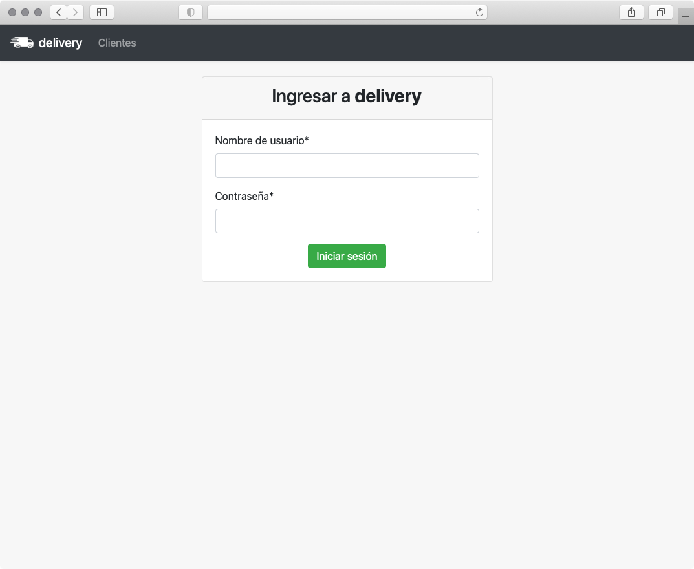
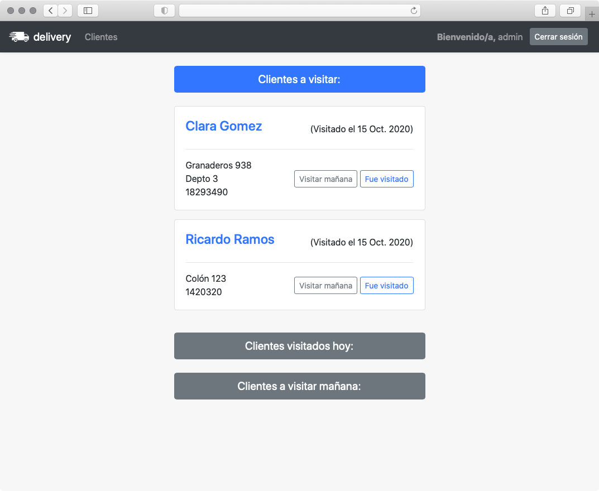
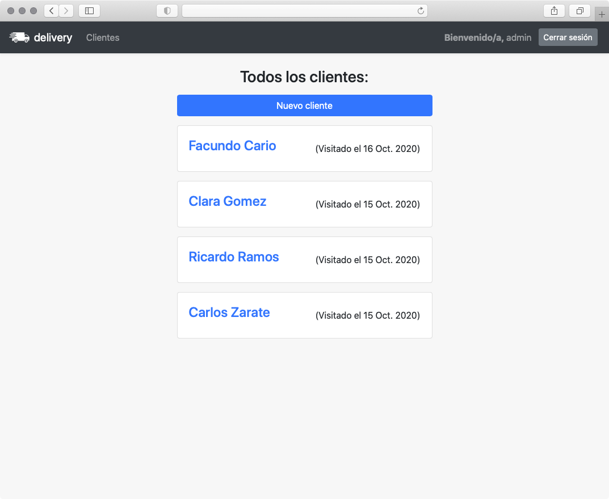
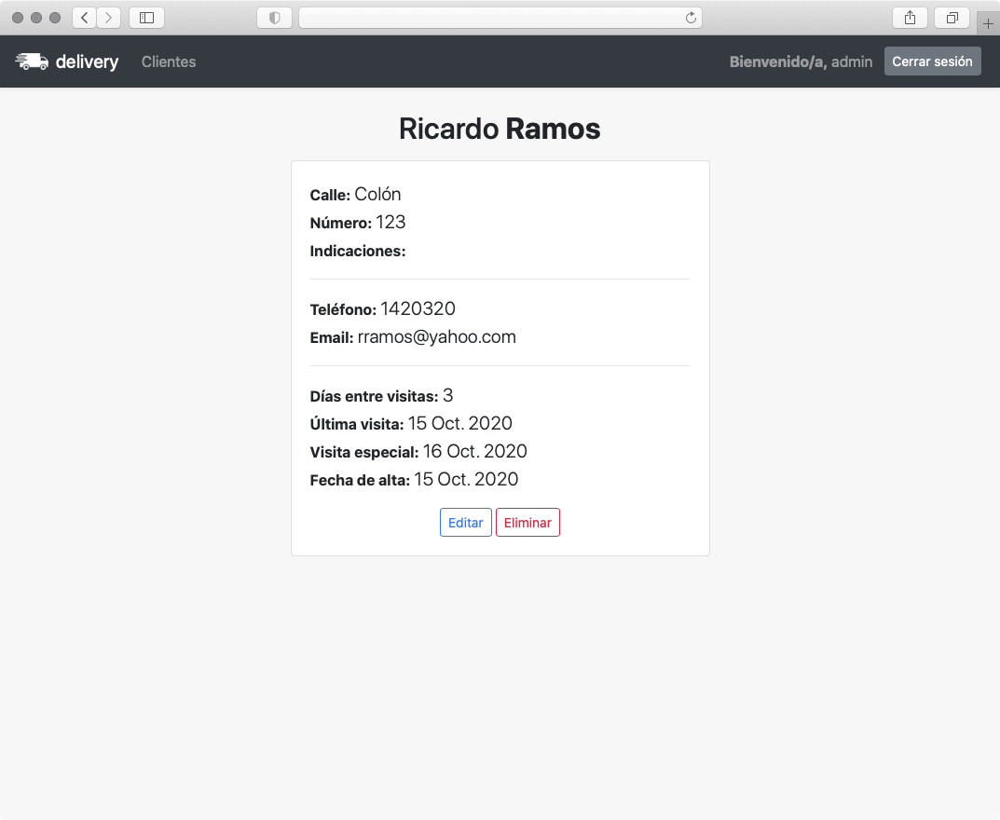
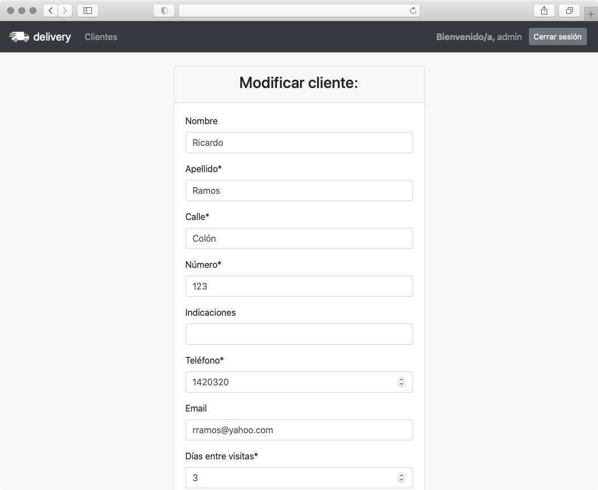

## **Delivery**

   Delivery es una aplicación Django simple, ideada para negocios que deben repartir productos periódicamente a sus clientes.

   Permite tener acceso a la información de cada cliente e informa a quién se le debe llevar u ofrecer el producto en el día y al día siguiente.

   Es posible configurar la frecuencia con que se debe visitar a un cliente y también mover la visita al día siguiente.

### Screenshots:

Desktop:

Movil:

#### Ejecución:

   1. Verificar que Python 3 y Django estén instalados.

   2. Ubicarse dentro del directorio donde se encuentra manage.py, y ejecutar desde la terminal:

      `$ pip install django-crispy-forms`

      `$ python manage.py makemigrations`

      `$ python manage.py migrate --run-syncdb`

      `$ python manage.py createsuperuser`

      `$ python manage.py runserver`

      Acceder en su navegador a la dirección [localhost:8000](http://localhost:8000)
